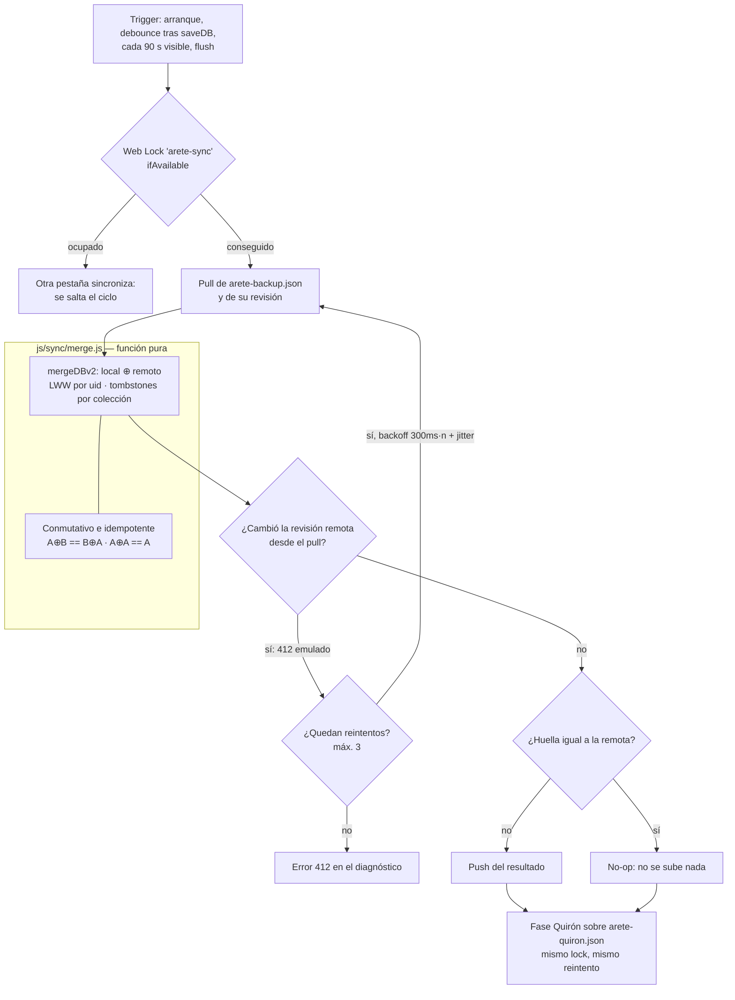

# Sync v2 — motor de sincronización real

Reemplaza al backup a ciegas (`silentBackup`) por un ciclo **pull → merge →
push** con merge conmutativo e idempotente. Diseño y decisiones; el código es
la fuente de verdad (`js/sync/`).

## La regla de oro

El merge es una **función pura**: `A⊕B == B⊕A` y `A⊕A == A`, probado con
tests de propiedad (200 semillas PRNG). Consecuencia: dos dispositivos que
intercambian estados cualesquiera **convergen al mismo estado**, sin
coordinación, sin relojes sincronizados, sin editar el histórico.

- El **orden de los arrays no es parte del contrato**: el merge devuelve orden
  determinista y las huellas usan `canonicalJson` (arrays ordenados). Sin
  esto, dos merges con el mismo contenido en distinto orden se empujarían el
  uno al otro en bucle.
- Empate de `updatedAt` → gana la **tombstone**; empate de contenido → gana el
  `canonicalJson` menor. Nunca "gana el local": bookreader lo hacía y se tapaba
  con digests; aquí la convergencia es del merge, no del retry.

## Piezas

| Módulo | Responsabilidad |
| --- | --- |
| `js/sync/merge.js` | `mergeDBv2` (db completa), `mergeCollections` (LWW por uid), `canonicalJson`, `stableStringify` |
| `js/sync/schema.js` | `SYNC_KEYS`, backfill uid/updatedAt, tombstones (TTL 30 días), stamps, shadow-diff (`stampChanges`/`createShadow`) |
| `js/sync/engine.js` | ciclo pull→merge→push, 412 emulado, Web Locks, diagnóstico |
| `js/sync/quiron.js` | merge puro de la conversación de Quirón (LWW por mensaje) |
| `js/drive.js` | transporte Drive REST (rev = `modifiedTime`), wrappers v1/v2 |

## Identidad y sellos (migración v7)

Todo item sincronizable tiene `uid = String(id)` y `updatedAt`. El backfill
**deriva los sellos de timestamps estables existentes** (`Date.parse(item.date)`,
createdAt): dos dispositivos que migran la misma db calculan los mismos sellos.
`Date.now()` masivo en migración fabricaría lost-updates contra nada.

El estampado en vivo es **shadow-diff**: `loadDB` fija el baseline
(`createShadow`), y cada `saveDB` compara contra él (`stampChanges`): items
editados reciben `updatedAt`, items desaparecidos se vuelven tombstone, los
escalares y sub-claves de objetos llevan stamp en `db.stamps`. Corregir una
serie mal tecleada arregla el objetivo siguiente al instante porque nada del
histórico se re-sella. `saveDBRaw` aplica merges remotos **sin** re-sellar:
re-sellar lo remoto fabricaría lost-updates contra ediciones genuinamente más
nuevas.

## Tombstones

`db.tombstones = [{uid, coll, deletedAt, updatedAt}]`. Un borrado crea
tombstone (dedup por uid+coll) y los borrados legacy (`deletedIds`, sin fecha)
se drenan en la migración v7 con `coll: 'legacy'`.

- Un tombstone **solo borra dentro de su colección**: los ids se numeran por
  colección y colisionan entre colecciones. `legacy` es conservador (filtra en
  todas) porque no conoce la suya.
- Revivir editando después del borrado es válido: `updatedAt >= tombstone.updatedAt`.
- TTL de 30 días (`purgeExpiredTombstones`), pero **el purge corre fuera del
  ciclo de sync**: purgar antes de push podría publicar un estado más débil que
  el remoto y resucitar borrados en dispositivos con más de 30 días offline.

## El ciclo (`createSyncEngine`)

1. **Pull** del fichero remoto (`arete-backup.json`). Payload v1 (sin `format`)
   se acepta: backfill antes de mezclar. JSON corrupto → error diagnosticado,
   nunca se pisa a ciegas.
2. **Merge** local ⊕ remoto con `mergeDBv2`. Si no cambia nada respecto a lo
   ya sincronizado (huella igual), **no hay push** — un sync no-op no sube nada.
3. **Push** del resultado. Antes de subir se re-lee la revisión remota: si
   cambió desde el pull de este ciclo (otro dispositivo ganó la carrera), se
   re-pullea, re-mezcla y reintenta — **412 emulado** (Drive no tiene
   If-Match), máx 3 reintentos con backoff `300ms·n + jitter`.
4. Justo después, la **fase Quirón** corre en el mismo ciclo (mismo lock, mismo
   reintento) sobre `arete-quiron.json`. Un fallo de Quirón degrada
   `diag.quiron` y jamás tira el ciclo de la db.

Estado persistido en localStorage (`arete-sync-state`): huella del último push
y revisión vista, para decidir no-ops al arrancar.

### Multi-pestaña

Web Locks (`'arete-sync'`, `ifAvailable`): la pestaña que no consigue el lock
se salta el ciclo en silencio — otra está sincronizando. El `location.reload()`
por storage-event **se queda**: es la red de seguridad cuando OTRA pestaña
cambia localStorage, y corre fuera del ciclo. Lo prohibido era recargar DENTRO
del ciclo; hoy el pull fusiona in-place y la UI se entera sin recargar.

### Triggers

Arranque a los 1500 ms · debounce 3 s tras cada `saveDB` · cada 90 s con la
pestaña visible · flush al ocultar y al recuperar conexión. Nada corre en
segundo plano oculto salvo el flush.

## Quirón (`arete-quiron.json`)

Fichero aparte — la conversación es prescindible y no debe pesar en el backup
de la db. Wrapper `{format:'arete-quiron', formatVersion:1, savedAt, device,
data:{convo, archive}}`.

- **LWW por mensaje** `{uid, ts, updatedAt, role, content}`: unión por uid,
  gana el `updatedAt` mayor, empate por `stableStringify`, orden final
  `(ts, uid)`. Conmutativo e idempotente (property tests incluidos).
- Backfill legacy determinista: uid = FNV-1a de role+content+índice de
  ocurrencia (dos dispositivos derivan los mismos uids de la misma conversación
  vieja), `ts = 0`. Sin `Date.now()`.
- El archivo (cap 15, FIFO) se sincroniza con LWW por conversación; el cap se
  re-aplica tras el merge, así que ambos dispositivos convergen a los mismos 15.
- Sin tombstones a propósito: borrar una conversación archivada en un
  dispositivo la resucitará al sincronizar — aceptado para datos de conveniencia.

## Diagnóstico

`getSyncDiag()` (expuesto por drive.js): último resultado, error, fallos
consecutivos e historial de los últimos 12 ciclos `{at, result, detail}`. Tras
**3 fallos consecutivos** se dispara `CustomEvent('arete-quiron…')` → no:
`'arete-sync-degraded'`, para que la UI pueda poner badge (la UI legible en
Ajustes es follow-up).

## Qué NO sincroniza

- Rutas GPS (`areteRuns` en IndexedDB): viajan con su propio flujo; el sync no
  las toca ni las rompe.
- `areteQuiron` crudo: se sincroniza vía su fichero propio, no dentro de la db.
- Tokens de Drive: viven en su propio flujo de auth (`drive-auth.js`).

## Pruebas

- `tests/sync-merge.test.js` — propiedad del merge db (200 semillas: conmutatividad,
  idempotencia, tie→tombstone, revival, no mutación de entradas).
- `tests/sync-schema.test.js` — backfill idempotente, shadow-diff, purge TTL, migración v7.
- `tests/sync-engine.test.js` — lost-update explícito, tombstones entre
  dispositivos, 412 converge y agota, no-op no sube, lock ocupado se salta.
- `tests/sync-quiron.test.js` — propiedad del merge Quirón, backfill
  determinista, cap 15, end-to-end A/B.
- `tests/drive.test.js` — transporte: wrapper v2, v1 backfill, ciclo completo.
